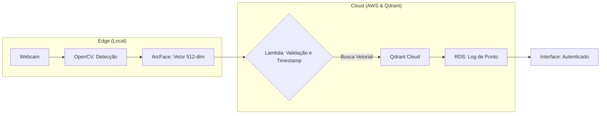

# Talvez a biblioteca so funcione em uma versão antiga do python (3.11.10)

# Planejamento de Projeto: Sistema de Ponto Eletrônico Distribuído (Arquitetura Híbrida)

## 1. Visão Geral

O sistema automatiza o registro de jornada de trabalho utilizando visão computacional (ArcFace) e busca vetorial em nuvem (Qdrant). A arquitetura separa o processamento de imagem na borda (Edge) da validação de regras de negócio na nuvem (AWS), garantindo segurança, escalabilidade e custo otimizado.

## 2. Arquitetura do Sistema

### **Módulo Local (Edge Computing):**

* Captura de vídeo em tempo real utilizando OpenCV.
* Detecção, alinhamento e recorte do rosto integrados via framework DeepFace.
* Extração de características faciais (geração do vetor de 512 dimensões) localmente utilizando o modelo ArcFace.
* Envio otimizado apenas dos dados numéricos (embeddings) para a API na nuvem, reduzindo a largura de banda necessária na rede.

### **Módulo Nuvem (Cloud Serverless & Database):**
* **Orquestração (AWS Lambda):** Validação de horário, sanitização de dados e orquestração da busca.
* **Banco Vetorial (Qdrant Cloud):** Motor de busca de similaridade facial (por semelhança entre vetores).
* **Armazenamento de Fotos (S3):** Armazenamento de fotos originais via SDK Boto3 para auditoria.
* **SGBD (RDS):** Registro final do ponto e dados relacionais do funcionário.


## 3. Fluxo de Funcionamento

1. O funcionário posiciona o rosto diante da câmera.
2. O **OpenCV** detecta a face e o **ArcFace** converte a imagem em um vetor numérico de 512 dimensões.
3. O script local envia o vetor para o **API Gateway/Lambda** na AWS.
4. O **Lambda** registra o timestamp oficial, valida regras de negócio (RDS) e consulta o **Qdrant** por similaridade.
5. Se identificado, o ponto é gravado com o horário da nuvem no banco de dados.

## 4. Estrutura de Diretórios do Projeto

```text
sistema-ponto-distribuido/
├── edge_node/                  # Processamento na borda
│   ├── main.py                 # Captura OpenCV + Extração ArcFace
│   ├── uploader.py             # Integração S3 (Boto3)
│   └── requirements.txt        # Dependências (opencv-python, deepface, boto3)
│
├── cloud_serverless/           # Lógica na nuvem (AWS)
│   ├── lambda_function.py      # Orquestrador (Validação + Qdrant API)
│   ├── requirements.txt        # Dependências Lambda (qdrant-client)
│   └── iam_policy.json         # Permissões S3/RDS/Lambda

```

## 5. Fluxograma Lógico



